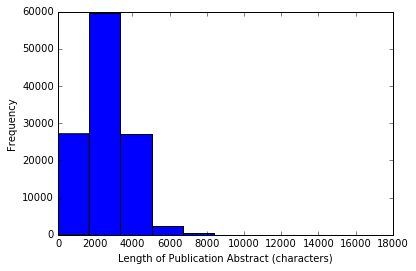

## MSci 446 Data Mining Project Status Update

**Project title: **
Data mining approach to aid multi-document summarization for empirical literature review

Group Members:  
Andrew Andrade, Andy Toulis, Baha Nurlybayev

### Brief Project Overview
Our project's objective is to scrape the abstracts of publications from a [OnePetro.org](http://onepetro.org) and match up Artificial Intelligence techniques used to specific Oil & Gas disciplines. So far we have worked on scraping the data, cleaning the data, and performed exploratory data analysis to better understand our data set.

### Data Collection, Cleaning and Storage
We have scraped over 180,000 publications from [OnePetro.org](http://onepetro.org) using `Mechanize` and `BeautifulSoup` libraries for parsing html and saved each publication's metadata into a text file in json format. We used a script to load each publication into python and perform some basic data cleaning before loading the data into a Postgres Database: 
- remove \n, \t, &nbsp, &amp, &quot <-- [seems unnessecary since tokenizer takes care of this]
- some articles did not have any abstracts, they were removed from our data set, this brought our data set down to 117,000 <-- [this papers legitimately did not have abstracts]
- some abstracts began with a concatenation of the words Abstract, Summary or Presentation to the first word of the abstract (with no space in between), we removed those words so we that our tokenizer would include the first word that was incorrectly concatenated
- entire texts of abstract and disciplines of the publications were saved and every other field was truncated at 255 characters
- we spent a lot of time dealing with infrastructure setup issues with Postgres (especially working across 3 different  operating systems) and were unable to effectively view data using psql, i.e. large text of data like abstract would mess up the view
- eventually, we abandoned the database approach of storing information and resorted to saving into .csv to persist our dataset between sessions and users.  The idea is that we can load the full .csv file into memory using a dataframe and do all the analysis in memory.
- A significant part of the analysis was the actual data sanitation.  The key takeaway is that real world data is difficult to deal with.  Different types, missing and even sometimes incorrect data all lead to problems.  The next section loads in the .csv file, sanitizes the data and does basic exploratory analysis


### Sanitizing unicode, mIssing Value and other fun things


```python
import numpy as np
import pandas as pd
import matplotlib.pyplot as plt
import math
import unicodedata
import re
import nltk
import json
import os
import codecs
from wordcloud import WordCloud

from sklearn import feature_extraction
import mpld3
%matplotlib inline 


```


```python
# paper_meta is 1000 random samples used to prototype
#data = pd.read_csv('/home/username/path/to/paper_meta.csv', low_memory=False, encoding='utf-8')

#note the .csv includes unicode characters (which will cause issues later)
data = pd.read_csv('/scratch/paperscraper/data_dump2/meta.csv', low_memory=False, encoding='utf-8')

```


```python
# take in text dump and cleans everything to string
def sanitize_text(data_input):
    
    # if none, return empty characer
    if type(None) == type(data_input):
        return ""
    
    # if not unicode, converting to string
    elif unicode != type(data_input):
        return str(data_input)
    
    # else unicode, encoding to ascii after normalizing
    # NOTE: unicode character with no ascii equivilent are removed!
    else:
        return unicodedata.normalize('NFKD', data_input).encode('ascii','ignore')
         
data = data.applymap(sanitize_text)

```


```python
#simple regex in include only digits
digits_only = re.compile(r'[^\d]+')

#convert date into a numeric year
def clean_date(date):
    if "nan" == date or "Nan" == date:
        0
    else:
        digit_only_date = digits_only.sub('', date)
        return float(digit_only_date)
    
data.date = data.date.map(clean_date)
```

### Exploratory Data Analysis

Now that we have our data somewhat sanitized, we attempted to visualize the data to get a better understanding before building any models


```python
start_date = data.date.min(axis=0)
end_date = data.date.max(axis=0)
date_range = end_date - start_date

data['date'].plot(kind='hist',bins = int(date_range),  cumulative=True)
plt.xlabel("Date (Year)")
plt.ylabel("Frequency of Papers Published")
```


    <matplotlib.text.Text at 0x7f3e3b756110>


We can see an exponentially increase number of publications over time.


```python
data['abstract_length'] = data['abstract'].apply(len)
data.abstract_length.plot(kind='hist')

plt.xlabel("Length of Publication Abstract (characters)")
plt.ylabel("Frequency")
```


    <matplotlib.text.Text at 0x7f3ed945ee90>





```python
data['abstract_length'] = data['abstract'].apply(len)


data.abstract_length.plot(kind='hist',bins =100)


plt.xlabel("Length of Publication Abstract (characters)")
plt.ylabel("Frequency")

```


    <matplotlib.text.Text at 0x7f3e3a7e1510>


Have a large number of abstracts with length of 0 mean that either some of the publications have no abstract or the scraping is scraping incorrect.

Further investigation indicates that both are reasons.  Some papers legitimately do not have abstracts posted, while for others the abstract was saved under a different `<div>`.  In the next iteration, more robust scaping will be conducted.


```python
data['title_length'] = data['title'].apply(len)


data.title_length.plot(kind='hist')


plt.xlabel("Length of Publication Title (characters)")
plt.ylabel("Frequency")

```


    <matplotlib.text.Text at 0x7f3ed8d85a10>


```python
data['title_length'] = data['title'].apply(len)


data.title_length.plot(kind='hist',bins =50,  cumulative=False)


plt.xlabel("Length of Publication Title (characters)")
plt.ylabel("Frequency")
```


    <matplotlib.text.Text at 0x7f3e3bc32690>


The intial EDA shows that the data is reasonable, so we can save the cleaned data and move onto more advanced exploratory data analysis


```python
#data.to_csv("/scratch/paperscraper/data_dump2/meta_cleaned.csv", sep=',')
```

### Exploratory Data Analysis
#### Combined abstracts
We took all the abstracts that were scraped and cleaned, then combined them into 1 giant text corpus. We then removed the basic english stopwords from the list, tokenized and stemmed the words and created a wordcloud. This gave us a clue into customizing our stopword list to include words like Oil, Gas and Drill that occured most frequently in almost all the abstracts. This involved a very long process of tokenizing everyword in the abstracts.


```python
#data = pd.read_csv('/scratch/paperscraper/data_dump2/meta.csv', low_memory=False)
```


```python
# load nltk's English stopwords as variable called 'stopwords'
stopwords = nltk.corpus.stopwords.words('english')
# display 10 stop words to check if working
print stopwords[:10]
```

    [u'i', u'me', u'my', u'myself', u'we', u'our', u'ours', u'ourselves', u'you', u'your']


```python
from nltk.stem.snowball import SnowballStemmer
stemmer = SnowballStemmer("english")
print stemmer
```

    <nltk.stem.snowball.SnowballStemmer object at 0x7f3e3a2cfc90>


```python
# here I define a tokenizer and stemmer which returns the set of stems in the text that it is passed

def tokenize_and_stem(text):
    # first tokenize by sentence, then by word to ensure that punctuation is caught as it's own token
    tokens = [word for sent in nltk.sent_tokenize(text) for word in nltk.word_tokenize(sent)]
    filtered_tokens = []
    # filter out any tokens not containing letters (e.g., numeric tokens, raw punctuation)
    for token in tokens:
        if re.search('[a-zA-Z]', token):
            filtered_tokens.append(token)
    stems = [stemmer.stem(t) for t in filtered_tokens]
    return stems


def tokenize_only(text):
    # first tokenize by sentence, then by word to ensure that punctuation is caught as it's own token
    tokens = [word.lower() for sent in nltk.sent_tokenize(text) for word in nltk.word_tokenize(sent)]
    filtered_tokens = []
    # filter out any tokens not containing letters (e.g., numeric tokens, raw punctuation)
    for token in tokens:
        if re.search('[a-zA-Z]', token):
            filtered_tokens.append(token)
    return filtered_tokens
```


```python
#not super pythonic, no, not at all.
#this takes 30 mins-1.5 hours to run
#use extend so it's a big flat list of vocab
totalvocab_stemmed = []
totalvocab_tokenized = []
count = 0
for i in data.abstract:
    allwords_stemmed = tokenize_and_stem(i) #for each item in 'synopses', tokenize/stem
    totalvocab_stemmed.extend(allwords_stemmed) #extend the 'totalvocab_stemmed' list
    
    allwords_tokenized = tokenize_only(i)
    totalvocab_tokenized.extend(allwords_tokenized)
    count = count + 1
    if count < 10:
        print count
    
    if count%10000 == 0:
        print count
```

    1
    2
    3
    4
    5
    6
    7
    8
    9
    10000
    20000
    30000
    40000
    50000
    60000
    70000
    80000
    90000
    100000
    110000


```python
# join vector of words to create corpus
stemmed_corpus = ' '.join(totalvocab_stemmed)
tokenized_corpus = ' '.join(totalvocab_tokenized)
```


```python
#write the corpus to file

with open("/scratch/paperscraper/data_dump2/stemmed_corpus.txt", "w") as text_file:
    text_file.write("%s" % stemmed_corpus)

with open("/scratch/paperscraper/data_dump2/tokenized_corpus.txt", "w") as text_file:
    text_file.write("%s" % tokenized_corpus)

```


```python

# Generate a word cloud image
wordcloud = WordCloud(width=1800,
                      height=1400,
).generate(tokenized_corpus)

plt.imshow(wordcloud)
plt.axis("off")

plt.savefig('./tokenized_wordcloud.png', dpi=300)
```


```python
wordcloud = WordCloud(width=1800,
                      height=1400,
).generate(stemmed_corpus)


plt.imshow(wordcloud)
plt.axis("off")

plt.savefig('./stemmed_wordcloud.png', dpi=300)
```


#### Reducing search terms
Since our use case pertains only to the AI techniques and which disciplines they are used in, we first check if the AI techniques list is in fact present in the combined abstracts. Any AI techniques that are not present are removed, since they are irrelevant to the library of publications that we are accessing.

#### Individual abstracts
We tokenized and stemmed every abstract on 1-2 gram words of text in preparation for comparing them against the search terms defined above. We then calculated and recorded the frequency of each search term. Any documents whose abstracts did not contain at least one of the search terms were discarded, since we are only interested in documents that describe AI techniques.

#### WordCloud on reduced data set
After narrowing down our dataset to those that only include AI technique search terms, we combined all the abstracts and created another wordcloud to compare against the wordcloud of all abstracts from [OnePetro.org](http://onepetro.org). This should show us the difference between the most frequent words used in the subset we are interested in compared to the superset of all abstracts, they may however come up with same words that are used universally across all oil and gas publications, which would give us further clues in including some of those words in the stop words dictionary.

TODO: What did we find? Include pictures of wordClouds.

#### Clustering
We performed k-means clustering using the cosine similarity on the frequency of AI techniques mentioned in each of the abstracts. We've tried using both the raw frequency and normalized frequency to see how the clusters might change. We've created 2..10 clusters and plotted the results to see if we could make sense of the relationship between cluster memberships.

TODO: What did we learn?

#### Tallying by frequency for each year
We tallied up the frequencies of the AI techniques for every year to see if we notice any trends. We don't expect to see any publications for AI techniques before 1970's, but the frequencies are expected to increase with every year with likely dips for years that the oil industry experienced downturns. We might also see some trends that coincide with the invention or popularization of particular AI techniques.

TODO: did we see any trends? Was our hypothesis confirmed?

### Next Steps
Now that our data has been cleaned up and prepared for data mining, we will need to create a training data set of at least 100 correctly classified publications. We will then use that training data and employ three different classification techniques to match up AI techniques to Oil & Gas disciplines. We are looking to classify using Naive Bayes, Bernoulli models and SVM and compare the results. We will also be employing Apriori for association rule mining for AI techniques as the left-hand side (association attributes) to see their co-occurence with Oil & Gas disciplines (as the right-hand side)


```python

```


```python

```


```python

```
